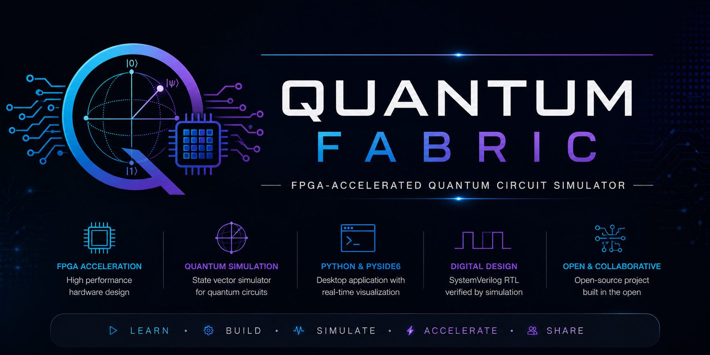
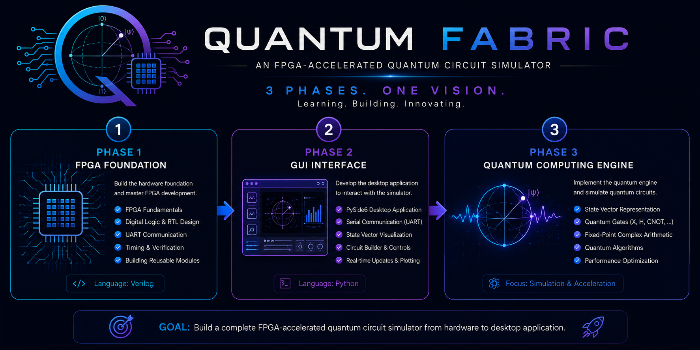
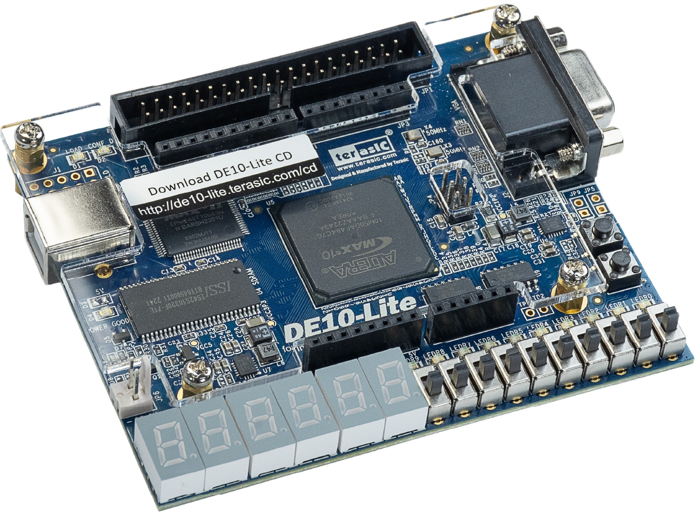
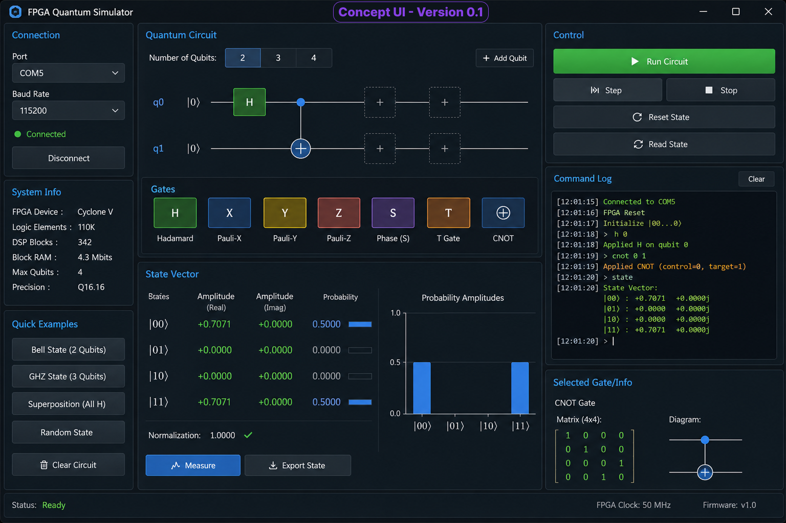

> *Documenting the journey of learning FPGA development while building a hardware-accelerated quantum circuit simulator from the ground up.*

---

## Vision

Quantum Fabric is an open engineering project whose goal is to explore the intersection of **FPGA design**, **digital signal processing**, and **quantum computing**.

Rather than building another software-only quantum simulator, this project investigates how quantum gate operations can be implemented using dedicated FPGA hardware.

The long-term objective is to design a modular architecture capable of simulating small quantum circuits while documenting every engineering decision, design trade-off, success, and failure along the way.

This repository is both a technical project and an engineering journal.

---

## Why This Project?

After more than 25 years designing and optimizing telecommunications networks, I decided to learn FPGA development by tackling a project that combines several of my interests:

* FPGA Design
* Digital Hardware
* Quantum Computing
* AI Hardware Acceleration
* Embedded Systems

Instead of following isolated tutorials, I wanted to learn by building a complete system—from hardware architecture to desktop software.

---

## Project Goals

### Version 1.0

* Simulate a 2-qubit quantum system
* Implement X, Hadamard, and CNOT gates
* Build a fixed-point arithmetic engine
* Communicate with a desktop application over UART
* Develop a PySide6 graphical interface
* Demonstrate Bell-state generation

### Future Versions

* Support additional quantum gates
* Expand to larger state vectors
* Improve arithmetic precision
* Explore FPGA acceleration techniques
* Implement small quantum algorithms
* Investigate real-time visualization
* Compare FPGA and CPU performance

---

## Project Phases



---

## Hardware Platform

* Intel (Altera) MAX 10 FPGA
* Terasic DE10-Lite Development Board
  


---
<!--
## User Interface Concept



---
-->
## Software Stack

* Quartus Prime
* SystemVerilog
* Python
* PySide6
* GitHub

---

## Repository Structure

```text
docs/
    Architecture
    Design Notes
    Development Log
    Verification

rtl/
    UART
    Arithmetic Engine
    Quantum Engine

simulation/
    Testbenches

python_reference/
    Software reference model

gui/
    PySide6 desktop application
```

---

## Engineering Philosophy

This project follows a few simple principles:

* Understand the design before writing code.
* Verify every hardware module through simulation.
* Document architecture decisions.
* Build incrementally.
* Share both successes and failures.
* Treat the project as a professional engineering effort.

---

## Current Progress

| Milestone                      | Status     |
| ------------------------------ | ---------- |
| Project Definition             | ✅ Complete |
| Development Board Selected     | ✅ Complete |
| Quartus Environment            | ✅ Complete |
| First FPGA Program (Blink LED) | ✅ Complete |
| GitHub Repository              | ✅ Complete |
| UART Communication             | ⏳ Planned  |
| Fixed-Point Arithmetic         | ⏳ Planned  |
| Quantum State Engine           | ⏳ Planned  |
| Bell State Demonstration       | ⏳ Planned  |
| PySide6 GUI                    | ⏳ Planned  |

---

## Follow the Journey

This repository is intentionally being developed in the open.

The goal is not only to build a working FPGA-based quantum simulator, but also to document the learning process for engineers, students, and anyone interested in digital design and quantum technologies.

Suggestions, discussions, and contributions are always welcome.

---

*"Every complex system begins with a single clock cycle."*
